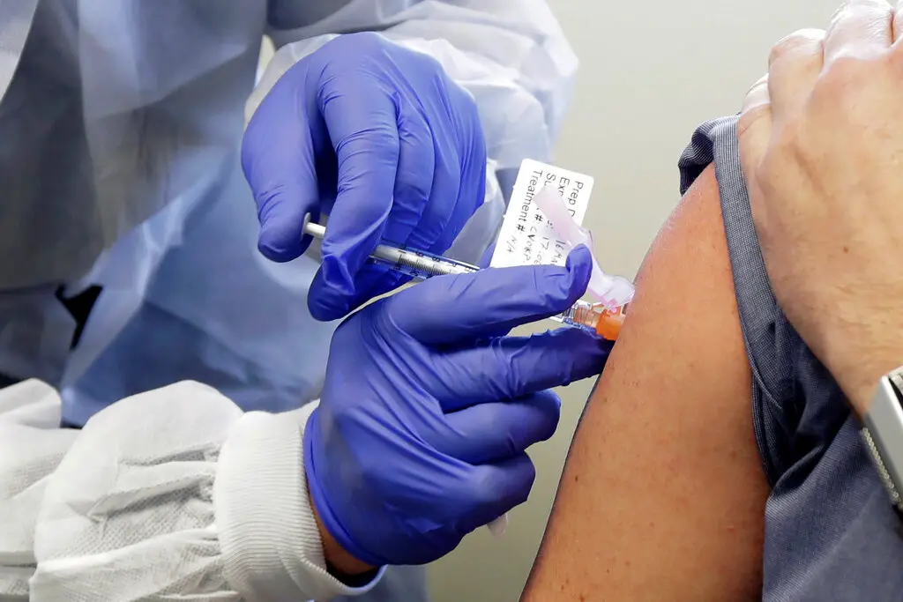
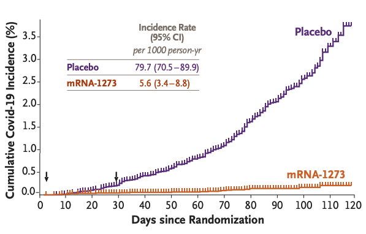
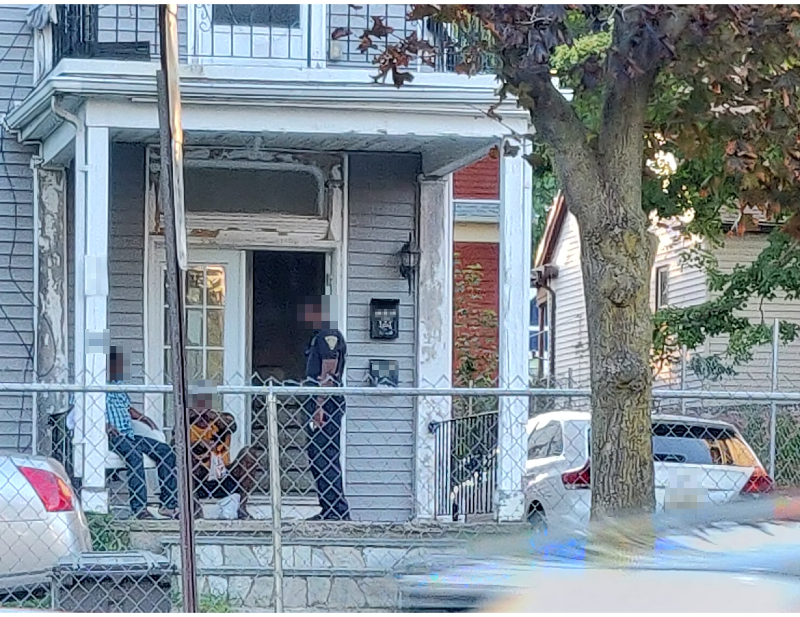
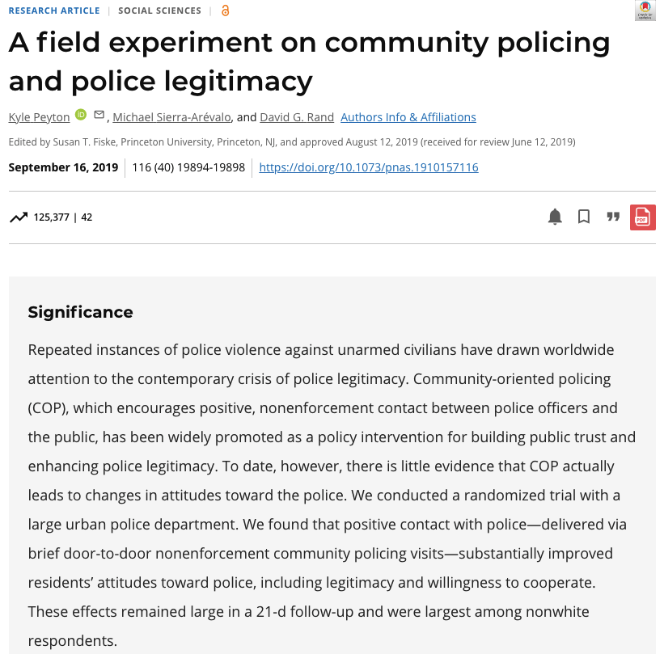
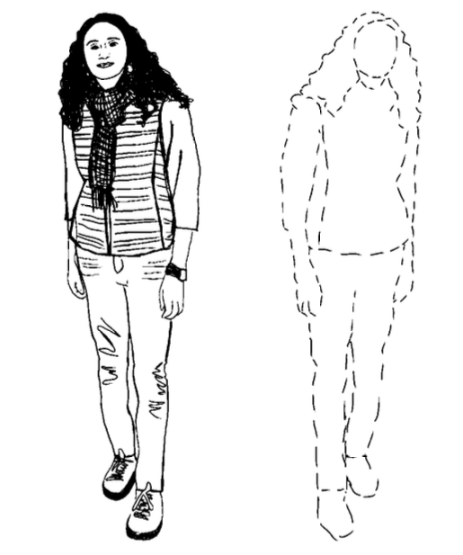
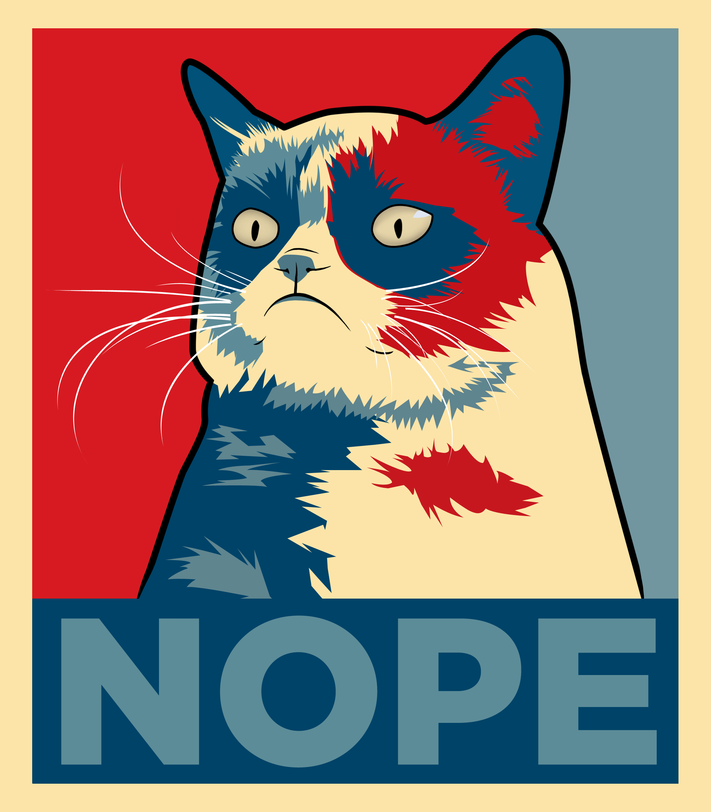
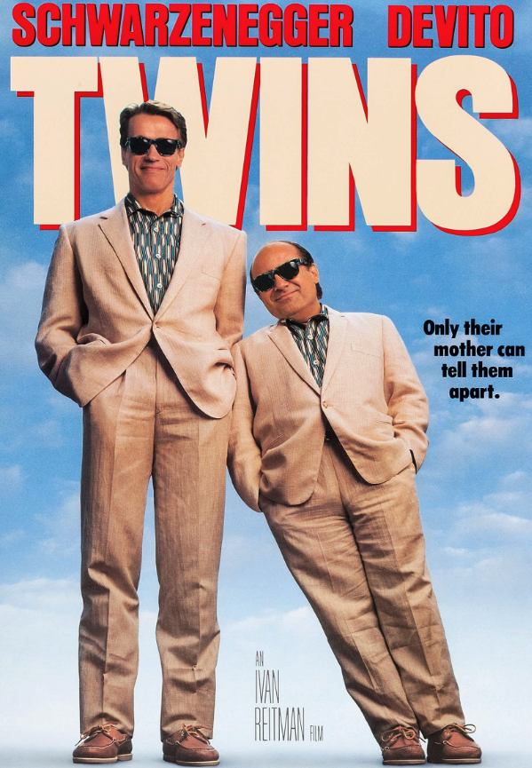
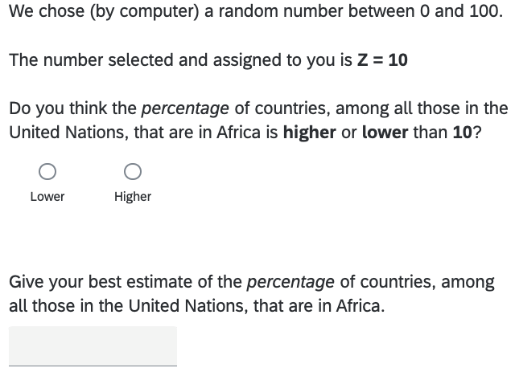

count: false
class: hide-count
```{css echo = FALSE}
.inverse .remark-slide-number {
  display: none;
}
.hide-count .remark-slide-number {
  display: none;
}
.my-slide h2 + p {
  margin-top: 0;
  margin-bottom: 0;
}

.custom-left {
  float: left;
  width: 40%; /* Adjust this percentage for the image */
}

.custom-right {
  float: right;
  width: 60%; /* Adjust this percentage for the bullet points */
}

.custom-left-rev {
  float: left;
  width: 60%; /* Adjust this percentage for the image */
}

.custom-right-rev {
  float: right;
  width: 40%; /* Adjust this percentage for the bullet points */
}

.custom-pull-left {
  float: left;
  width: 50%; /* Adjust this percentage for the image */
}

.custom-pull-right {
  float: right;
  width: 50%; /* Adjust this percentage for the bullet points */
}
```

```{r setup, include=FALSE}
knitr::opts_chunk$set(warning = FALSE, message = FALSE, 
                      fig.retina = 3, fig.align = "center")
```

```{r packages-data, include=FALSE}
library(tidyverse)
library(flair)
library(broom)
library(ggdag)
library(kableExtra)
library(scales)
library(patchwork)
library(ggplot2)
library(ggforce)
library(ggthemes)
#xaringan::inf_mr()
```

```{r xaringanExtra, echo=FALSE}
xaringanExtra::use_xaringan_extra(c("tile_view"))
```

<div style = "position:fixed; visibility: hidden">
$$\require{color}\definecolor{yellow}{rgb}{1, 0.8, 0.16078431372549}$$
$$\require{color}\definecolor{orange}{rgb}{0.96078431372549, 0.525490196078431, 0.203921568627451}$$
$$\require{color}\definecolor{green}{rgb}{0, 0.474509803921569, 0.396078431372549}$$
</div>

<script type="text/x-mathjax-config">
MathJax.Hub.Config({
  TeX: {
    Macros: {
      yellow: ["{\\color{yellow}{#1}}", 1],
      orange: ["{\\color{orange}{#1}}", 1],
      green: ["{\\color{green}{#1}}", 1]
    },
    loader: {load: ['[tex]/color']},
    tex: {packages: {'[+]': ['color']}}
  }
});
</script>

<style>
.yellow {color: #FFCC29;}
.orange {color: #F58634;}
.green {color: #007965;}
</style>

<style>
  .remark-slide-content:not(.title-slide) > h1 {
    margin-top: 0.15em;
    margin-bottom: 0.25em; 
  }
  
  .remark-slide-content:not(.title-slide) > h2 {
    margin-bottom: 0.25em; 
  }
  
  .remark-slide-content {
    padding-left: 5%; 
    padding-right: 5%; 
  }
</style>

# Roadmap for today
--

- Introduction to causal inference and experimentation

--

- Description of classroom activity to facilitate student learning

--

- Overview of my research agenda and potential contributions to the School and the University of Melbourne

--

## Learning objectives:

--

1. Introduction to counterfactuals and the logic of causal inference

--

2. Description of the fundamental problem of causal inference 

--

3. Understand why randomization "solves" the problem

--

4. Discover a new causal effect together! 

---
count: false
# What is Causal Inference? 

--
<div style="display: flex; justify-content: center; align-items: center; width: 100%;">
  <div style="width: 50%; padding-left: 0px; padding-right: 10px">
    
  </div>

  <div style="width: 50%; padding-right: 0px; padding-left: 5px; text-align: left; white-space: nowrap;">
    Two roads diverged in a yellow wood,<br>
    And sorry I could not travel both<br>
    And be one traveler, long I stood<br>
    And looked down one as far as I could<br>
    To where it bent in the undergrowth;<br>
    <br>
    -Robert Frost, <em>The Road Not Taken</em>
  </div>
</div>

--

We can only observe what happens in reality 

--

We do not observe what would have happened if we made different decisions 

--

We can nevertheless **imagine** these counterfactual worlds

--

Causal inference involves comparisons between **potential outcomes**

<!-- --- -->
<!-- count: false -->
<!-- # What is causal inference?  -->

<!-- <div style="display: flex; justify-content: center; align-items: center; width: 100%;"> -->
<!--   <div style="width: 50%; padding-left: 0px; padding-right: 10px"> -->
<!--      -->
<!--   </div> -->
<!--   <div style="width: 50%; padding-right: 0px; padding-left: 5px; text-align: left; white-space: nowrap; color: green;"> -->
<!--     Two treatments emerged in a research field,<br> -->
<!--     And sorry I could not observe both<br> -->
<!--     And be one analyst, long I pondered<br> -->
<!--     And studied one as far as I could<br> -->
<!--     To grasp the potential outcome that lay untold;<br> -->
<!--     <br> -->
<!--     -<em>The Potential Outcome Not Sampled</em> -->
<!--   </div> -->
<!-- </div> -->


<!-- We can only observe what happens in reality  -->


<!-- We do not observe what would have happened if we made different decisions  -->


<!-- We can nevertheless **imagine** these counterfactual worlds -->


<!-- Causal inference involves comparisons between **potential outcomes** -->

---
# What is Causal Inference? 

--
<div style="display: flex; justify-content: center; align-items: center;">
  <div class="slide: data-xaringan-increment" style="background-color: black; color: white; padding: 40px; width: 200px; text-align: center; margin-right: 20px; border-radius: 10px;">
    Factual
  </div>
--
  <span class="slide: data-xaringan-increment" style="font-size: 2em;">vs</span>
  <div class="slide: data-xaringan-increment" style="background-color: white; color: black; padding: 40px; width: 200px; text-align: center; margin-left: 20px; border-radius: 10px; border: 2px dashed black;">
    Counterfactual
  </div>
</div>
--

## Examples of Causal Questions

<style>
  .remark-slide-content li ul li {
    font-size: 0.9em;
  }

  .remark-slide-content ul li {
    margin-bottom: 0.25em;
  }
    
  /* Decrease the space between the second-level bullet points */
  .remark-slide-content li ul li {
    margin-bottom: 0.25em; 
    margin-top: 0.5em;
  }
  
  .reveal ul ul, .reveal ol ol {
  font-size: inherit;
  }
  
</style>
--

- Do mRNA vaccines (e.g., "Spikevax") reduce the chances of getting Covid?

--

  - Infection rates decreased after a vaccination program was implemented 

--
  - Would infection rates have gone up if the vaccination program *was not* implemented?

--

- Do community policing practices lead to increased public trust and a greater willingness to cooperate with the police?

--
  - Police-community relations are characterized by conflict and distrust in places where the police do not use community policing

--
  - Would things be different in those places if the police *did* use community policing?
  
--

**Fundamental problem of causal inference:** we can never observe counterfactual outcomes, they must be inferred

---
class: left, top
# Example: Covid-19 Vaccination Study
<div style="display: flex; justify-content: center; align-items: center; width: 100%;">
  <div style="width: 50%; padding-left:0; padding-right:5px">
    
    <figcaption style="font-size: small; margin-top: 0px;">Source: <em> Ted S. Warren/Associated Press, </em>2020</figcaption>
  </div>
  <div style="width: 50%; padding-left:5px; padding-right:0px">
    
<figcaption style="font-size: small; margin-top: 0px;">Source: Baden et al.,<em> New England Journal of Medicine, </em>2020</figcaption>
  </div>
</div>

<script>
  function setEqualHeight(images) {
    var maxHeight = 0;

    images.forEach(function(img) {
      img.onload = function() {
        maxHeight = Math.max(maxHeight, img.clientHeight);
        images.forEach(function(innerImg) {
          innerImg.style.height = maxHeight + 'px';
          innerImg.style.objectFit = 'contain';
        });
      };
    });
  }

  setEqualHeight(document.querySelectorAll('.presentation-image'));
</script>

- Can mRNA vaccines reduce the incidence of Covid-19 infections and prevent illness, including severe disease?

--

  - Randomly assign individuals to either receive a shot with the active vaccine ("treatment") or a shot with saline placebo ("control")
  
--

  - Compare the number of new symptomatic COVID-19 cases that were reported among participants in each group


---
class: left, top

# Example: Community Policing Study
<div style="display: flex; justify-content: center; align-items: center; width: 100%;">
  <div style="width: 50%; padding-left:0; padding-right:5px">
    
    <figcaption style="font-size: small; margin-top: 0px;">Source: fieldwork conducted in New Haven, Connecticut, 2019</figcaption>
  </div>
  <div style="width: 50%; padding-left:5px; padding-right:0px">
    
    <figcaption style="font-size: small; margin-top: 0px;">Source: Peyton et al.,<em> Proceedings of the National Academy of Sciences </em>, 2019</figcaption>
  </div>
</div>

<script>
  function setEqualHeight(images) {
    var maxHeight = 0;

    images.forEach(function(img) {
      img.onload = function() {
        maxHeight = Math.max(maxHeight, img.clientHeight);
        images.forEach(function(innerImg) {
          innerImg.style.height = maxHeight + 'px';
          innerImg.style.objectFit = 'contain';
        });
      };
    });
  }

  setEqualHeight(document.querySelectorAll('.presentation-image'));
</script>


--

- Can changing police behavior in the field increase trust and cooperation between officers and the communities they serve? 

--

  - Randomly assign households to experience positive, non-enforcement contact with uniformed patrol officers ("treatment") or no contact ("control")

--

  - Compare attitudes towards police (e.g., trust, willingness to cooperate) among residents in each group 

---
class:custom
# Measuring Causal Effects: Individual Comparisons

<div class="custom-left">
  <br>
  <br>
  <br>
  
</div>

--
<div class="custom-right" style="display: flex; justify-content: center;">
  <p style="margin-top: 2.5em; text-align: left; width: 90%;">Can we observe <strong>both</strong> potential outcomes for the same individual at the exact same time under the same circumstance?</p>
</div>

--
<div data-xaringan-increment class="custom-right" style="display: flex; justify-content: center; align-items: center;">
  
</div>
<div class="custom-right" style="display: flex; justify-content: center;">
  <p style="margin-bottom: 0; text-align: left; width: 90%;"><strong>Fundamental Problem of Causal Inference</strong></p>
</div>
--
<div class="custom-right" style="display: flex; justify-content: center;">
  <p style="margin-top: 1em; text-align: left; width: 90%;"><strong>Solution</strong>: find "good" approximations for counterfactual outcomes</p>
</div>


---
# Measuring Causal Effects: Individual Comparisons
<br>
<table style="border-collapse: collapse; width: 60%; padding-top: 10px">
  <tr style="background-color: #c6c6c6; border-bottom: 0.5px solid; border-top: 1.5px solid; padding-top: 0px; padding-bottom: 0px;">
    <th style="background-color: #c6c6c6; text-align: left; font-weight: bold; width: 100px; word-wrap: break-word; vertical-align: middle;"><div style="height: 1.2em; line-height: 1.2em; margin-top: 0em;"></div></th>
    <th style="width: 100px; word-wrap: break-word; vertical-align: middle;"><div style="height: 2.4em; line-height: 1.2em; margin-top: 0em; display: flex; align-items: center; justify-content: center;">Community policing visit </div></th>
    <th style="width: 100px; word-wrap: break-word; vertical-align: middle;"><div style="height: 2.4em; line-height: 1.2em; margin-top: 0em; display: flex; align-items: center; justify-content: center;">Trust in police</div></th>
  </tr>
  <tr>
    <td style="text-align: left;">Person 1</td>
    <td style="text-align: center;">Yes</td>
    <td style="text-align: center;">High</td>
  </tr>
  <tr>
    <td style="text-align: left;">Person 2</td>
    <td style="text-align: center;">No</td>
    <td style="text-align: center;">Low</td>
  </tr>
</table>
<br>

--

Did Person 1 report a high level of trust **because** they received the community policing visit? 

--

<br>
<table style="border-collapse: collapse; width: 90%; padding-top: 10px">
  <tr style="background-color: #c6c6c6; border-bottom: 0.5px solid; border-top: 1.5px solid; padding-top: 0px; padding-bottom: 0px;">
    <th style="background-color: #c6c6c6; text-align: left; font-weight: bold; width: 100px; word-wrap: break-word; vertical-align: middle;"><div style="height: 1.2em; line-height: 1.2em; margin-top: 0em;"></div></th>
    <th style="width: 100px; word-wrap: break-word; vertical-align: middle;"><div style="height: 2.4em; line-height: 1.2em; margin-top: 0em; display: flex; align-items: center; justify-content: center;">Community policing visit </div></th>
    <th style="width: 100px; word-wrap: break-word; vertical-align: middle;"><div style="height: 2.4em; line-height: 1.2em; margin-top: 0em; display: flex; align-items: center; justify-content: center;">Trust in police</div></th>
    <th style="width: 100px; word-wrap: break-word; vertical-align: middle;"><div style="height: 2.4em; line-height: 1.2em; margin-top: 0em; display: flex; align-items: center; justify-content: center;">Race/ethnicity</div></th>
  </tr>
  <tr>
    <td style="text-align: left;">Person 1</td>
    <td style="text-align: center;">Yes</td>
    <td style="text-align: center;">High</td>
    <td style="text-align: center;">White</td>
  </tr>
  <tr>
    <td style="text-align: left;">Person 2</td>
    <td style="text-align: center;">No</td>
    <td style="text-align: center;">Low</td>
    <td style="text-align: center;">Black</td>
  </tr>
</table>
<br>

---
count: false
# Measuring Causal Effects: Individual Comparisons
<br>
<table style="border-collapse: collapse; width: 60%; padding-top: 10px">
  <tr style="background-color: #c6c6c6; border-bottom: 0.5px solid; border-top: 1.5px solid; padding-top: 0px; padding-bottom: 0px;">
    <th style="background-color: #c6c6c6; text-align: left; font-weight: bold; width: 100px; word-wrap: break-word; vertical-align: middle;"><div style="height: 1.2em; line-height: 1.2em; margin-top: 0em;"></div></th>
    <th style="width: 100px; word-wrap: break-word; vertical-align: middle;"><div style="height: 2.4em; line-height: 1.2em; margin-top: 0em; display: flex; align-items: center; justify-content: center;">Community policing visit </div></th>
    <th style="width: 100px; word-wrap: break-word; vertical-align: middle;"><div style="height: 2.4em; line-height: 1.2em; margin-top: 0em; display: flex; align-items: center; justify-content: center;">Trust in police</div></th>
  </tr>
  <tr>
    <td style="text-align: left;">Person 1</td>
    <td style="text-align: center;">Yes</td>
    <td style="text-align: center;">High</td>
  </tr>
  <tr>
    <td style="text-align: left;">Person 2</td>
    <td style="text-align: center;">No</td>
    <td style="text-align: center;">Low</td>
  </tr>
</table>
<br>


Did Person 1 report a high level of trust **because** they received the community policing visit? 


<br>
<table style="border-collapse: collapse; width: 90%; padding-top: 10px">
  <tr style="background-color: #c6c6c6; border-bottom: 0.5px solid; border-top: 1.5px solid; padding-top: 0px; padding-bottom: 0px;">
    <th style="background-color: #c6c6c6; text-align: left; font-weight: bold; width: 100px; word-wrap: break-word; vertical-align: middle;"><div style="height: 1.2em; line-height: 1.2em; margin-top: 0em;"></div></th>
    <th style="width: 100px; word-wrap: break-word; vertical-align: middle;"><div style="height: 2.4em; line-height: 1.2em; margin-top: 0em; display: flex; align-items: center; justify-content: center;">Community policing visit </div></th>
    <th style="width: 100px; word-wrap: break-word; vertical-align: middle;"><div style="height: 2.4em; line-height: 1.2em; margin-top: 0em; display: flex; align-items: center; justify-content: center;">Trust in police</div></th>
    <th style="width: 100px; word-wrap: break-word; vertical-align: middle;"><div style="height: 2.4em; line-height: 1.2em; margin-top: 0em; display: flex; align-items: center; justify-content: center;">Race/ethnicity</div></th>
    <th style="width: 100px; word-wrap: break-word; vertical-align: middle;"><div style="height: 2.4em; line-height: 1.2em; margin-top: 0em; display: flex; align-items: center; justify-content: center;">Prior contact</div></th>
  </tr>
  <tr>
    <td style="text-align: left;">Person 1</td>
    <td style="text-align: center;">Yes</td>
    <td style="text-align: center;">High</td>
    <td style="text-align: center;">White</td>
    <td style="text-align: center;">No</td>
  </tr>
  <tr>
    <td style="text-align: left;">Person 2</td>
    <td style="text-align: center;">No</td>
    <td style="text-align: center;">Low</td>
    <td style="text-align: center;">Black</td>
    <td style="text-align: center;">Yes</td>
  </tr>
</table>
<br>

---
class:custom
# Measuring Causal Effects: Overcoming Challenges

<div class="custom-left-rev" style="display: flex; justify-content: center;">
  <p style="margin-top: 2.5em; text-align: left; width: 90%;"><strong>Goal:</strong> compare people that that are identical on all dimensions <em>except for </em> the treatment they received!</p>
</div>

--
<div class="custom-right-rev">
  
</div>

<div class="custom-left-rev" style="display: flex; justify-content: center;">
  <p style="margin-top: 0.5em; text-align: left; width: 90%;"><strong>Problem:</strong> we can't "control for" everything </p>
</div>

--

<div class="custom-left-rev" style="display: flex; justify-content: center;">
  <p style="margin-top: .5em; text-align: left; width: 90%;"><strong>Solution:</strong> random assignment of treatment!</p>
</div>

--

<div class="custom-left-rev" style="display: flex; justify-content: center;">
  <p style="margin-top: .5em; text-align: left; width: 90%;"><strong>Randomized experiment:</strong> research design that ensures treatment and control groups are, <em>on average</em>, identical to each other on all observed (and unobserved) background characteristics</p>
</div>

--

<div class="custom-left-rev" style="display: flex; justify-content: center;">
  <p style="margin-top: .5em; text-align: left; width: 90%;"><strong>Implication:</strong> the only thing that distinguishes the two groups, besides the treatment itself, is chance. </p>
</div>

---
# Randomization in the Policing Experiment

--
.center[
<iframe src="https://kyle-peyton.shinyapps.io/BalanceR/" width="100%" height="600" frameborder="0"></iframe>
]


---
# Classroom Activity: Survey Experiment 

--

- "An experiment that looks like a survey" (Gelman and Nolan. <em> Teaching Statistics.</em> Oxford University Press)

--

- Short survey before class first asks a few background questions (e.g., age) 
--

- Next, half the students would see the following question, with **Z = 10**. The other half would see the same question, but with **Z = 65**:

.center[
<div style="display: flex;">
  <div class="incremental" style="flex: 1; padding-top: .5em">
    
  </div>
</div>
]

---
# Classroom Activity: Discussion and Analysis

**Question 1**: will the two groups be balanced on average age, etc.?

--

Of course! The groups were created by random assignment.

--

**Question 2**: will the value of **Z** that students were assigned affect the average guess?

--

Of course not! Everyone was told it was just a randomly generated number...

--

However, the average guess when **Z = 10** will be *lower* than when **Z = 65**
--
```{r example-plot, echo = FALSE, results='asis', fig.width=10, fig.height=5}
generate_discrete_samples <- function(n_samples, desired_mean, desired_sd) {
  # Create a vector of integer values from 0 to 100
  values <- 0:100
  
  # Compute a pmf with the desired mean and standard deviation
  pmf <- dnorm(values, mean = desired_mean, sd = desired_sd)
  pmf <- pmf / sum(pmf)  # Normalize the pmf to sum to 1
  
  # Generate random samples from the distribution
  samples <- sample(values, size = n_samples, replace = TRUE, prob = pmf)
  
  return(samples)
}

set.seed(123)

# Low guess
low <-
  generate_discrete_samples(n_samples = 100,
                            desired_mean = 10,
                            desired_sd = 13)

# High guess
high <-
  generate_discrete_samples(n_samples = 100,
                            desired_mean = 20,
                            desired_sd = 15)

age <- sample(x = c(20, 21, 22, 23, 24, 25), size = 200, replace = TRUE, 
              prob = c(0.10, 0.10, 0.15, 0.25, 0.25, 0.15))

dat <-
  data.frame(Y = c(low, high), Z = c(rep("Prompted with Z = 10", 100), 
                                     rep("Prompted with Z = 65", 100)),
             age = age, student = 1:200)

# Calculate summary statistics for each facet
summary_stats <- 
  dat %>%
  group_by(Z) %>%
  summarize(mean = mean(Y),
            sd = sd(Y),
            n = n())

# Create the faceted histogram plot
ggplot(dat, aes(x = Y, fill = Z)) +
  geom_histogram(bins = 20,
                 color = "black",
                 alpha = 0.7) +
  facet_row( ~ Z) +
  geom_text(
    data = summary_stats,
    aes(
      label = paste("\nAverage =", round(mean, 1), "\nsd =", round(sd, 1), "\nn =", n, ""),
      x = Inf,
      y = Inf
    ),
    hjust = 1,
    vjust = 1.05,
    size = 5
  ) +
  labs(x = "Guessed percentage of African countries in U.N.", y = "t", title = "") +
  scale_y_continuous("", expand = expansion(mult = c(0, .1))) +
  scale_x_continuous(limits = c(-4.0625, 102), expand = c(0, 1)) +
  scale_fill_colorblind() +
  theme_bw() +
  theme(
    axis.title.x = element_text(size = 14),
    panel.grid.major = element_blank(),
    panel.grid.minor = element_blank(),
    axis.line.x = element_line(color = "black", linewidth =  0.5),
    axis.line.y = element_line(color = "black", linewidth = 0.5),
    panel.background = element_blank(),
    axis.text.y = element_text(size = 14),
    axis.text.x = element_text(size = 14),
    strip.text = element_text(size = 14, face = "bold"),
    legend.position = "none",
    panel.spacing = unit(1, "lines")
  ) 
```

---
# Overview of research agenda

--

**Broad interests**: how intergroup relations and attitudes toward government shape beliefs, preferences, and behaviors.

--

**Empirical approach**: statistics, causal inference, and qualitative field research. 

--

### Intergroup Conflict and Cooperation

--
How does interaction between different social groups influence trust, cooperation, and the dynamics between these groups in various political and social contexts?

--

### Trust in Government and Inequality

--
How do economic disparities, perceptions of fairness, and peoples' trust in political institutions interact to shape policy preferences and political engagement?
<!-- How do inequality and experiences with government shape people's political preferences and behaviors? -->

--

### Fairness, Prejudice, and Political Resentment

--
How do perceptions of fairness and prejudiced attitudes contribute to political resentment and shape the dynamics of group-based conflicts?
<!-- How do people's beliefs about fairness and justice influence political conflicts between groups? -->


---
# Potential contributions

--
**Research and collaboration:**

--

- "Problem solving" approach uses qualitative and quantitative empiricial methods to address normatively significant, real-world problems

--

- Strong publication record, and demonstrated capacity to attract research funding

--

- Experience forging external partnerships and interdisciplinary collaborations

--

**Teaching and student supervision:**

--

- Demonstrated excellence in teaching research methods to students at all levels, from a wide variety of disciplines

--

- Committment to student mentoring and research training using the collaborative lab-style research model

--

**Service and engagement:**

--

- Highly skilled at leading complex, large-scale research projects and organising conferences/seminars for variety of audiences

--

- Keen to contribute to programs/courses in research methods training at all levels
  
---
class: center, middle, inverse
count: false
# Thank you!


<div style="font-size: 1.5em; margin-bottom: 0.5em; margin-top: 0.5em;">
  <span style="display: inline-block; vertical-align: middle;">`r icons::icon_style(icons::fontawesome("envelope", style = "solid"), fill = "white")` <a href="mailto:kyle.peyton@acu.edu.au">kyle.peyton@acu.edu.au</a></span>
</div>

<div style="font-size: 1.5em; margin-bottom: 0.5em;">
  <span style="display: inline-block; vertical-align: middle;">`r icons::icon_style(icons::fontawesome("mouse", style = "solid"), fill = "white")` <a href="https://kyle-peyton.com/">https://kyle-peyton.com/</a></span>
</div>

<div style="font-size: 1.5em; margin-bottom: 0.5em;">
  <span style="display: inline-block; vertical-align: middle;">`r icons::icon_style(icons::fontawesome("twitter"), fill = "white")` <a href="https://twitter.com/pylekeyton">@pylekeyton</a></span>
</div>


